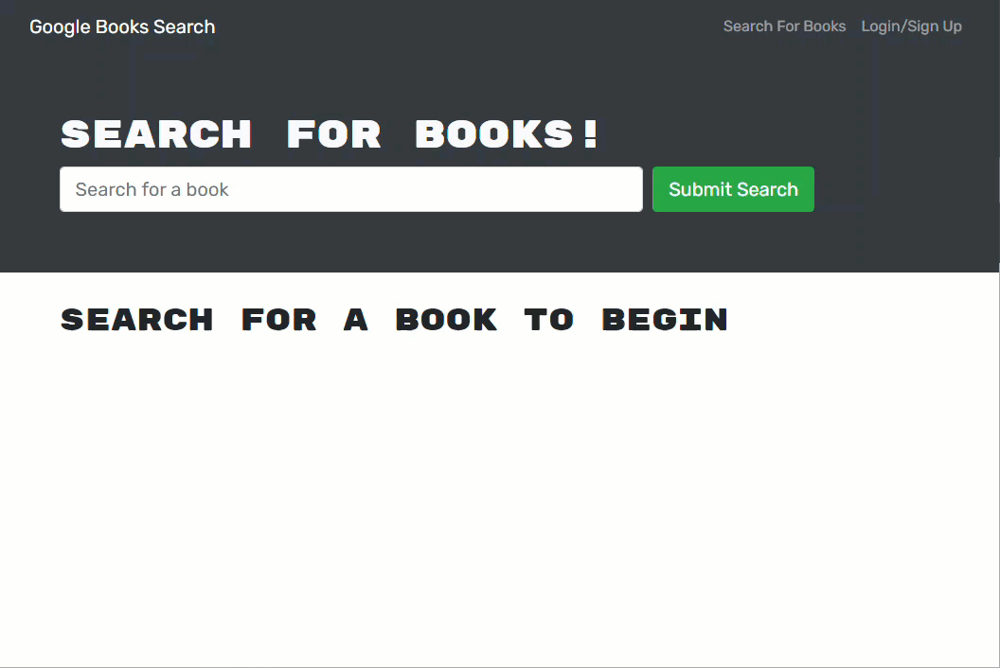

<h1 align="center">Book Search Engine</h1>
<h2 align="center">MERN Stack with GraphQL API and Apollo Server</h2>

## Description

This application refactors an existing Google Books API search engine build with RESTful API into one leveraging GraphQL API using Apollo Server. It allow users to search for books and save them to their personal profile for later viewing. The application is deployed to Heroku and can be found here: [Book Search Engine](https://book-search-engine-69146.herokuapp.com/)

## Table of Contents

- [Usage](#usage)
- [License](#license)
- [How to Contribute](#how-to-contribute)
- [Questions](#questions)

## Usage

[Book Search Engine](https://book-search-engine-69146.herokuapp.com/)

Users are able to keyword-search for books through the Google Books API. Optionally, users can also signup with a new account or login with an existing account. If they are logged in, they have the option to save books to their personal profile for later viewing and also remove books from their profile.

## License

This application is covered under the MIT license. Information about this license can be found [here](http://choosealicense.com/licenses/mit/).

## How to Contribute

[MichaelHermes](https://github.com/MichaelHermes)

## Questions?

Find me on [Github](https://github.com/MichaelHermes) or email me at [mikehermes87@gmail.com](mailto:mikehermes87@gmail.com).
